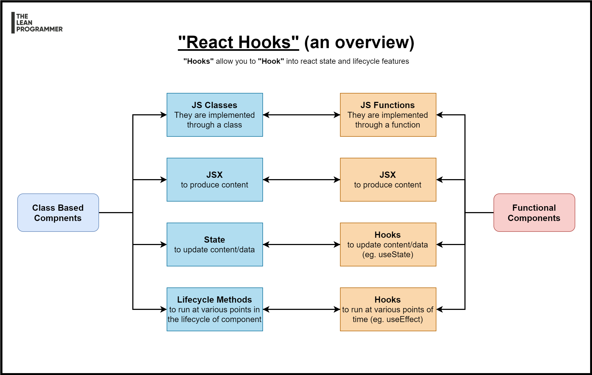

# NIT Trichy x The Lean Programmer

~~Presentation~~ **Documentation** (we are devs 😎) for topics I covered during my ReactJS session at NIT Trichy!


***

## Resources

After the workshop, do watch more React Tutorials -

| S.No   |      Topic      | Event/YouTube link | 
|--------|-----------------|--------------------|
| 1      | Understanding the Basics - JSX + State + Props | [https://www.youtube.com/playlist?list=PLGyA74h_S9NqJvvQ7-l9bUHHS6bMCkgo0](https://www.youtube.com/playlist?list=PLGyA74h_S9NqJvvQ7-l9bUHHS6bMCkgo0) |
| 2      | Lifecycle Methods + Making Network Requests | [https://www.youtube.com/playlist?list=PLGyA74h_S9NppHNrzUSjMQbnuHS9jlAcY](https://www.youtube.com/playlist?list=PLGyA74h_S9NppHNrzUSjMQbnuHS9jlAcY) |
| 3      | Understanding Flexbox | [https://www.youtube.com/playlist?list=PLGyA74h_S9NrkKnaIrYeOolru4EakosHY](https://www.youtube.com/playlist?list=PLGyA74h_S9NrkKnaIrYeOolru4EakosHY) |
| 4      | React + TypeScript | [https://www.youtube.com/playlist?list=PLGyA74h_S9NrjM7mUiSmpKfUntwEcgMB3](https://www.youtube.com/playlist?list=PLGyA74h_S9NrjM7mUiSmpKfUntwEcgMB3) |
| 5      | React Portals | [https://www.youtube.com/playlist?list=PLGyA74h_S9Nq-rRLG5pqEiaJ87H22S3BW](https://www.youtube.com/playlist?list=PLGyA74h_S9Nq-rRLG5pqEiaJ87H22S3BW) |

## Agenda 

1. Speaker introduction and chit chat 
2. what will we build today
3. Some set up beforehand
4. Introduction to HTML, CSS
5. JavaScript and DOM Manipulation
6. Why React?
7. React Components
8. Sample Component Architecture
9. One way data flow
10. JSX
11. State
12. Props
13. Lifecycle Methods
14. The counter application
15. React Hooks
16. The useState hook
17. The useEffect hook
18. Lifecycle methods vs useEffect
19. API calls
20. Building our mega app
21. Deploying our app
22. Limitations of "only" react
23. Where to go from here
24. QnA

## What are we going to build today?

"Crypto + Top" = Cryptop

Check out the app in action here - [https://theleanprogrammer.com/cryptop/](https://theleanprogrammer.com/cryptop/)


## Let's set up our dev env

1. Install NodeJS (with npm) - [https://nodejs.org/](https://nodejs.org/)
2. Install VSCode - [https://code.visualstudio.com/download](https://code.visualstudio.com/download)
3. [Optional] Download git - [https://git-scm.com/](https://git-scm.com/)
4. [Optional] Create a GitHub account - [https://github.com/MadhavBahl](https://github.com/MadhavBahl)
5. Create 2 "CRA" projects

### 1. Counter App

1. `npx create-react-app counter`
2. `cd playground`
3. `npm start`

### 2. Cryptop

1. `npx create-react-app cryptop`
2. `cd playground`
3. `npm start`

## Why React?

1. Fast Learning Curve
2. Reusable components
3. Fast Render with Virtual DOM
4. Great Dev Tools
5. Great Dev Community
6. Proper Modularization
7. Clean Abstraction
8. React Native, React Desktop

## React Components


## React Sample Component Architecture for Pokedex App

See the app in action here: [http://madhavbahl.tech/react-pokedex](http://madhavbahl.tech/react-pokedex)


## React Component Hierarchy and One Way Data Flow


## JSX

HTML + JS 😎

## State

Any data that you might need to save as the current state of application (per session) to display it on screen or use for any calculations/logic, which might change in future.

## Props

Passing down a piece of data (or method) from parent component to child component.

## Sample Application

Let's build a counter app!

## React Lifecycle Methods


## React Hooks



## useState hook

Let's you use state in functional components

```ts
const [ state, setState ] = useState<StateSchema>(initialState)
```

## useEffect hook

Similar to lifecycle methods, but different :D

```js
useEffect(() => {
  // Method you wish to run
}, [dependencyArray]);
```

## useEffect dependency array

Different cases of dependency array

### 1. `[]` - Empty array

Runs at the initial render only!

```js
useEffect(() => {
  console.log ("This will run at initial render of the component only")
}, []);
```

### 2. Array with some data - `[data]`

- runs at initial render
- runs whenever `data` changes

```js
useEffect(() => {
  console.log ("This will run at initial render")
  console.log (`This will also run when data - ${data} - changes`);
}, [data]);
```

### 3. Nothing...

- Runs at initial render
- Runs at every re-render

```js
useEffect(() => {
  console.log ("This is going to run initially + everytime when anything changes");
});
```

## Let's build our mega app!

1..2..3.. Let's jump on to VS Code!

## Deploy

1. Create github repo
2. `npm install gh-pages --save-dev`
3. Add homepage in package.json - `"homepage": "http://madhavbahlmd.github.io/sample-react-app"`
4. Add deploy scripts (shown below)
5. `git add .`
6. `git commit -m "Your commit message"`
7. `git push -u origin master`
8. `npm run deploy`

**Deploy script**

```
{
    "predeploy": "npm run build",
    "deploy": "gh-pages -d build"
}
```

***

That's it! Hope you enjoyed the session.